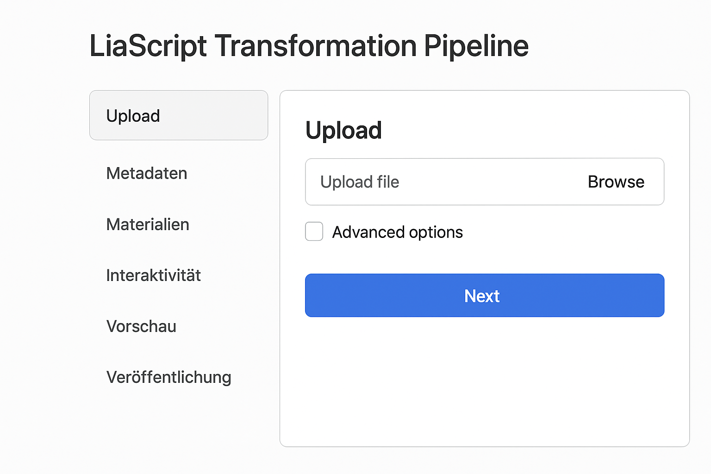

<!--

import: https://raw.githubusercontent.com/liaScript/mermaid_template/master/README.md

-->

# Ausblick 

Wir haben uns heute damit beschäftigt, wie man "eigene" LiaScript-Inhalte erstellen kann und dafür

+ Grundlegende Konzepte kennengelernt und 
+ die Syntax in einem Tutorial ausprobiert.

Der folgende Abschnitt gibt einige Tipps zur Verwendung und diskutiert zukünftige Entwicklungen. 

## Professionelle Nutzung 

1. Nutzen Sie eine Versionsverwaltung (Git/GitHub/GitLab) für Ihre Inhalte.
2. Verwenden Sie eine lokale Entwicklungsumgebung (VSCode, Gitpod).
3. Nutzen Sie den Exporter um Ihre Inhalte in verschiedene Formate zu bringen (PDF, HTML, ePub).
4. Verwenden Sie CI/CD (GitHub Actions, GitLab CI) um Ihre Inhalte automatisch zu bauen und zu veröffentlichen.
5. Nutzen Sie die Community (Forum, Discord, GitHub) für Fragen und Austausch.

!?[](https://private-user-images.githubusercontent.com/10922356/293702414-00a24602-dc63-4b9a-894b-80967b914513.mp4?jwt=eyJ0eXAiOiJKV1QiLCJhbGciOiJIUzI1NiJ9.eyJpc3MiOiJnaXRodWIuY29tIiwiYXVkIjoicmF3LmdpdGh1YnVzZXJjb250ZW50LmNvbSIsImtleSI6ImtleTUiLCJleHAiOjE3NTg2MDYzNDksIm5iZiI6MTc1ODYwNjA0OSwicGF0aCI6Ii8xMDkyMjM1Ni8yOTM3MDI0MTQtMDBhMjQ2MDItZGM2My00YjlhLTg5NGItODA5NjdiOTE0NTEzLm1wND9YLUFtei1BbGdvcml0aG09QVdTNC1ITUFDLVNIQTI1NiZYLUFtei1DcmVkZW50aWFsPUFLSUFWQ09EWUxTQTUzUFFLNFpBJTJGMjAyNTA5MjMlMkZ1cy1lYXN0LTElMkZzMyUyRmF3czRfcmVxdWVzdCZYLUFtei1EYXRlPTIwMjUwOTIzVDA1NDA0OVomWC1BbXotRXhwaXJlcz0zMDAmWC1BbXotU2lnbmF0dXJlPWUyNzdjN2RiMGYxNjliMjhiNTdkNGYzYzBiMzNjMTIwNDEzMmMzYzQ5M2RjYTZkNTQ1OTJkYjljMTM5ZjY5YjQmWC1BbXotU2lnbmVkSGVhZGVycz1ob3N0In0.VKxe-xwdRoVMccKy2QyZUZBegfHvSou0V0SRuTABAyQ)

## Aktuelle Arbeiten / Projekte 

Anwendungen:

+ LiaScript im Kontext der Berufsausbildung (Projekt [DiAgnostiK](https://uelu-digital.de/))
+ Anwendung der OER Idee in Schulen ([Aufgabensammlung Mathematik](https://mint-the-gap.github.io/Aufgabensammlung/))
+ Kombination aus interaktiven Inhalten und Remote Labs (CrossLab Projekt)

Technische Weiterentwicklung:

+ Umbau des LiaExporter als eigenständiges Tool [Pitch Talk](https://liascript.github.io/course/?https://raw.githubusercontent.com/LiaPlayground/Hackatoern2025_Pitch/refs/heads/main/README.md)
+ Verbesserung der Usability des Live-Editors

## Antragsidee Transformationspipeline

> **Zielstellung:** Die automatische Transformation und Anreicherung von traditionellen Lehr-Lern-Inhalten (PDF, PowerPoint) in LiaScript ist sinnvoll, weil …
>
> - Lehrende bestehende Materialien direkt weiterverwenden können,
> - Inhalte durch Interaktivität (Quizze, Simulationen) lebendiger werden,
> - Offene Bildungsressourcen (OER) einfacher entstehen und gepflegt werden können,
> - Studierende ein zeitgemäßes, interaktives Lernerlebnis erhalten.

| Schritt                                  | Beschreibung                                                    | KI                                    | Mensch                    |
| ---------------------------------------- | --------------------------------------------------------------- | ------------------------------------- | ------------------------- |
| 1. Konvertierung & Überarbeitung         | Umwandeln von PDF/PPT in Markdown (Text, Bilder, Formeln, Code) | ✅  Transformation                    | 🔄  Anpassung            |
| 2. Didaktische Annotation                | Identifikation und Integration der Lernziele                    | 🔄 Extraktion                        | ✅  Kontrolle             |
| 3. Inhaltliche Aufwertung                | Einbettung von Videos, Audios, Bildern, zusätzlichen Dokumenten | 🔄 Vorschläge                        | ✅ Auswahl                |
| 4. Meta-Informationen                    | Schlagwörter, Autorendaten, Lizenzinformationen                 |                                       | ✅ Definition             |
| 5. Aufwertung durch interaktive Elemente | Quiz, Simulationen, Visualisierungen, Codebeispiele             | ✅ Vorschläge                         | ✅ didaktische Evaluation |
| 6. Veröffentlichung                      | Speichern & Versionieren in Git/GitHub/GitLab                   | ✅ Automatisierung der Transformation |                           |

Eine GUI könnte als Web-App die Schritte visuell darstellen, per Klick durchführbar machen und so Lehrende unterstützen.  

